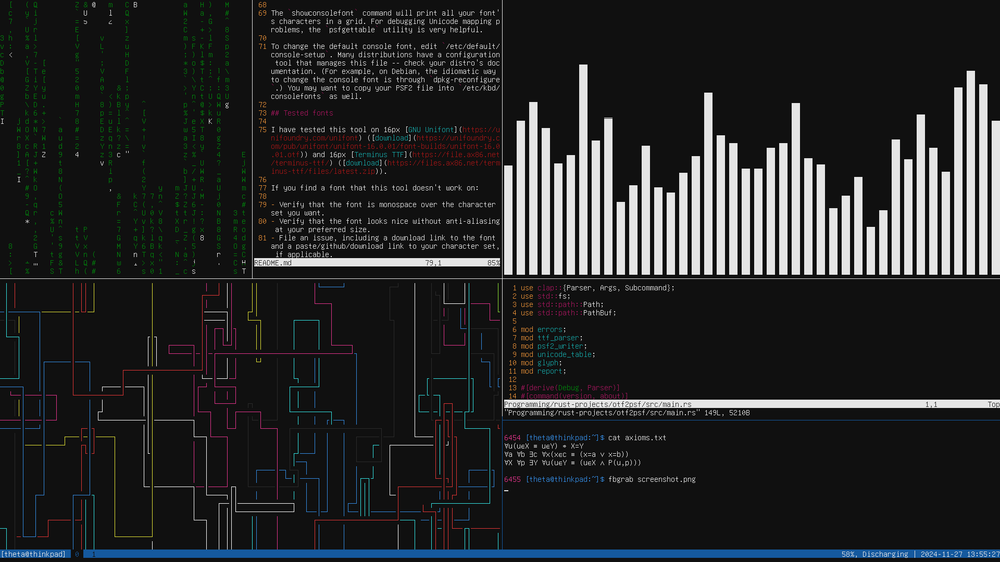

# otf2psf

This tool creates a PSF2 Linux console font from a modern OTF/TTF monospace font.

It works on fonts that contain embedded bitmap strikes, as well as those with only vector characters. 

## Why?

Fancy symbols in the TTY. All the box-drawing characters your heart desires. Your favorite modern font, backported to an ancient and vestigial bitmap format. What more could you ask for in life?



## Installation

Clone this repo, `cargo build --release`, and copy the output binary to /bin if desired.

## Usage

Simplest case:

```
otf2psf convert in.otf out.psf
```

This command rasterizes in.otf at 16px height, writing to out.psf. To change the font size, add a positional argument: `otf2psf convert in.otf out.psf 12` will rasterize at 12px instead.

By default, the first 256 Unicode characters will be included in the output font. To include a different number of characters, pass the `-g` flag. You can generate arbitrarily long fonts, but fonts longer than 512 characters will not work on a Linux TTY.

Alternatively, you can specify a Unicode character set:

```
otf2psf convert in.otf out.psf --unicode-table-file my.set
```

See the "Charset file format" section for more information on creating a Unicode character set.

If you get an error that not all characters in the font have the same size, you can use the `--pad` flag to pad out all glyphs to the size of the largest glyph.

If `--pad` makes most glyphs look way too far apart, try the `report` subcommand to view the size of each glyph (and some other information):

```
otf2psf report in.otf --unicode-table-file my.set > report.txt
```

After identifying the problem glyph that is too large, you can remove it from the charset or try a different font.

If the glyphs just look weird, missing parts, lumpy, etc -- you're probably trying to rasterize the font at a size where it can't be rendered pixel-perfectly. Try adjusting the size, and if the situation doesn't improve, choose a different font.

## Charset file format

See `example.set` for a valid example charset. Comments beginning with `#` and blank lines are ignored. Each line contains a list of Unicode characters or sequences, which will all be represented by the same glyph in the PSF2 font. 

For example, this line:
```
U+00E9, U+0065 U+0301
```
means that the same glyph should be used to represent the single character `U+00E9` (LATIN SMALL LETTER E WITH ACUTE) and the sequence `U+0065 U+0301` (ASCII lowercase e + combining acute accent).

Generally, each listed Unicode sequence should be a single [grapheme cluster](https://www.unicode.org/reports/tr29/#Grapheme_Cluster_Boundaries). In particular, trying to use this system for ligatures is doomed to failure.

When generating bitmaps, `otf2psf` must pick a "representative grapheme" to render from the input OTF font. For now, it selects the grapheme with the fewest codepoints. (So `U+00E9` with one codepoint beats `U+0065 U+0301` with two.) In case of a tie, the grapheme listed first is selected. I plan on making this behavior customizable in the future.

## Using the generated font

These fonts are meant for TTY environments, not terminal emulators (most of which use TTF/OTF fonts natively). Switch to a TTY, then run `setfont [/path/to/out.psf]` and your new PSF2 font will be loaded. You cannot load a new font from inside tmux, but you can open or attach to tmux once the font is loaded, and everything will be displayed in the new font.

If the new font is broken or displays poorly, `setfont default8x16` will switch to a working font. If `default8x16` isn't present on your system, check `/etc/kbd/consolefonts` for a font that will work.

After switching fonts, all previous text in the TTY might look corrupted (characters are mapped to the wrong glyphs). Don't worry about it, just `clear`. Future text will look fine.

The `showconsolefont` command will print all your font's characters in a grid. For debugging Unicode mapping problems, the `psfgettable` utility is very helpful. 

To change the default console font, edit `/etc/default/console-setup`. Many distributions have a configuration tool that manages this file -- check your distro's documentation. (For example, on Debian, the idiomatic way to change the console font is through `dpkg-reconfigure`.) You may want to copy your PSF2 file into `/etc/kbd/consolefonts` as well.

## Tested fonts

I have tested this tool on 16px [GNU Unifont](https://unifoundry.com/unifont) ([download](https://unifoundry.com/pub/unifont/unifont-16.0.01/font-builds/unifont-16.0.01.otf)) and 16px [Terminus TTF](https://file.ax86.net/terminus-ttf/) ([download](https://files.ax86.net/terminus-ttf/files/latest.zip)).

If you find a font that this tool doesn't work on:

- Verify that the font is monospace over the character set you want.
- Verify that the font looks nice without anti-aliasing at your preferred size.
- File an issue, including a download link to the font and a paste/github/download link to your character set, if applicable.

## Caveats

Technically you can create a PSF2 font with whatever characters you'd like. However, if you want your font to be usable by the Linux kernel, there are some constraints you should obey.

- Due to a nofix kernel bug, blank space in the TTY is filled with the 32nd (0x20th) glyph in the PSF2 font, regardless of whether that glyph is actually mapped to space or not. So the 32nd listed character in your charset should be U+0020 (space).
- There are kernel-imposed size constraints on the glyphset portion of the font. The kernel can support a maximum of 512 glyphs and a max glyph size of 64x128 pixels.
- Some very low-level functions, eg SysReq functions, will disregard the font's Unicode mapping table when printing ASCII. For best compatibility, preserve the indices of all ASCII characters in the Unicode table. (For example, the 41st (0x65th) listed character should be `U+0065`, or capital A). I didn't do that in `example.set` because I'm lazy.
- I think the kernel is bad at dealing with Unicode sequences. I haven't been able to get it to render `U+0065 U+0301` (or any other multi-codepoint Unicode sequence) properly, for example. However, this could be a problem with how I am serializing the PSF2 Unicode table -- not sure.

Of course, PSF2 fonts may be used by other systems besides the Linux kernel. (For example, other OSes or embedded software.) Each of these systems will have its own requirements, bugs, extra specifications, etc.
